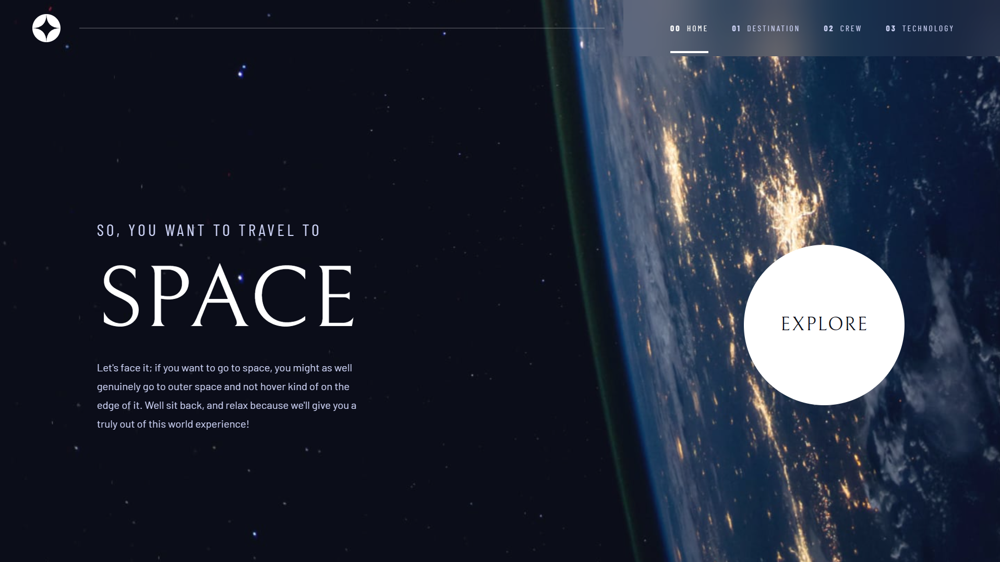

# Frontend Mentor — Space Tourism Website



<div align="center">

[](https://space-tourism-tau-amber.vercel.app/)
[](https://www.frontendmentor.io/challenges/space-tourism-multipage-website-gRWj1URZ3)
[](https://github.com/jihadTH4/Space-Tourism)

</div>

---

## Overview

A multi-page space tourism website built as a solution to the [Frontend Mentor Space Tourism challenge](https://www.frontendmentor.io/challenges/space-tourism-multipage-website-gRWj1URZ3). The site features four pages — Home, Destination, Crew, and Technology — each with its own interactive tab/navigation system and fully responsive layout across mobile, tablet, and desktop.

### Features

- Responsive layout for mobile (375px), tablet (768px), and desktop (1440px)
- Smooth page transitions and content animations
- Tab navigation on the Destination page
- Dot navigation on the Crew page
- Numbered navigation on the Technology page
- Accessible hamburger menu on mobile with slide-in drawer
- Hover and active states on all interactive elements

### Pages

| Page | Route | Navigation Style |
|------|-------|-----------------|
| Home | `/` | — |
| Destination | `/destination` | Text tabs (Moon / Mars / Europa / Titan) |
| Crew | `/crew` | Dot selector |
| Technology | `/technology` | Numbered buttons (1 / 2 / 3) |

---

## Built With

- **React 19** — UI library
- **TypeScript** — Type safety throughout
- **Vite** — Build tool and dev server
- **Tailwind CSS v4** — Utility-first styling with `@tailwindcss/vite` plugin
- **React Router v7** — Client-side routing
- **Google Fonts** — Bellefair (serif) + Barlow + Barlow Condensed

---

## Project Structure

```
src/
├── types/          # TypeScript interfaces (Destination, CrewMember, Technology)
├── data/           # All static site content in one place
├── components/
│   ├── layout/
│   │   └── Header.tsx       # Fixed nav, mobile hamburger, active link styling
│   └── ui/
│       ├── PageHeading.tsx  # Numbered section headings ("01 PICK YOUR DESTINATION")
│       ├── TabNav.tsx       # Text tab navigation (Destination page)
│       ├── DotNav.tsx       # Dot selector (Crew page)
│       └── NumberNav.tsx    # Numbered circle buttons (Technology page)
├── pages/
│   ├── Home.tsx
│   ├── Destination.tsx
│   ├── Crew.tsx
│   ├── Technology.tsx
│   └── NotFound.tsx
└── index.css       # Tailwind v4 @import, @theme, keyframe animations
```

---

## Getting Started

### Prerequisites

- Node.js 18+
- npm or yarn

### Installation

```bash
# 1. Clone the repository
git clone https://github.com/jihadTH4/Space-Tourism.git

# 2. Navigate into the project
cd Space-Tourism

# 3. Install dependencies
npm install

# 4. Start the dev server
npm run dev
```

The app will be available at `http://localhost:5173`.

### Build for Production

```bash
npm run build
```

Output goes to the `dist/` folder, ready to deploy on any static host.

---

## Deployment

This project is deployed on **Vercel**.

🔗 **Live Site:** [https://space-tourism-tau-amber.vercel.app](https://space-tourism-tau-amber.vercel.app)

To deploy your own fork:

1. Push the repo to GitHub
2. Import the project on [vercel.com](https://vercel.com)
3. Vercel auto-detects Vite — no extra configuration needed
4. Every push to `main` triggers an automatic re-deploy

---

## Author

- **GitHub** — [@jihadTH4](https://github.com/jihadTH4)
- **Frontend Mentor** — [@jihadTH4](https://www.frontendmentor.io/profile/jihadTH4)

---

## Acknowledgments

Challenge designed by [Frontend Mentor](https://www.frontendmentor.io). Original design collaboration between Frontend Mentor, Scrimba, and Kevin Powell.
